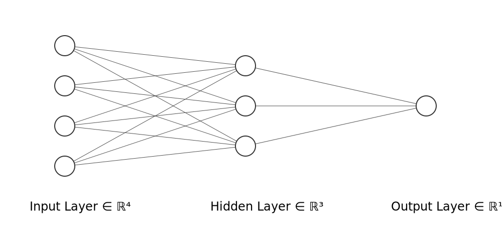

# Basic data flow through autograd

This example contains a very simple multi layer model meant to understand how autograd is used in Hasktorch to compute gradients. To be able to verify the results of the model, the weights have been taken equal to 1. ReLU and Sigmoid activations have been applied and mean squared error has been used for the loss. Results can be verified with the derivation of gradients done below.

For Hasktorch, the autograd function takes the loss along with a list of Independent Tensors (need to be specifically made here) with respect to which the derivative is to found. But for the normal operation, the tensors should be dependent tensors, as would be clear in the code.

## Architecture of the neural network

(Visualization created at https://alexlenail.me/NN-SVG/)

<div align = "center">

</div>

## Derivation of the gradients w.r.t. Loss
<div align = "center">

### Output of the model (Sigmoid Activation) :


</div>

<div align = "center">

### Hidden layer output (ReLU Activation) :


</div>

<div align = "center">

### Loss function for the model (Squared mean error) :

</div>

<div align = "center">

### Derivative of Loss w.r.t. w<sub>211</sub> (weight connecting the first unit in 2nd layer, with the first unit in the next layer)

</div>

<div align = "center">

</div>
<div align = "center">

</div>
<div align = "center">

</div>
<div align = "center">
The gradient for other weights in the layer can also be derived in a similar manner.
</div>

<div align = "center">

### Derivative of Loss w.r.t. w<sub>111</sub> (weight connecting the first unit in 1st layer, with the first unit in the next layer)

</div>

<div align = "center">

</div>
<div align = "center">

</div>
<div align = "center">

</div>
<div align = "center">
The gradient for other weights in the layer can also be derived in a similar manner.
</div>


## Running the Example

Setup environment variables (run this from the top-level hasktorch project
directory where the `setenv` file is):

```
source setenv
```

Building and running:

```
stack run autograd
```
